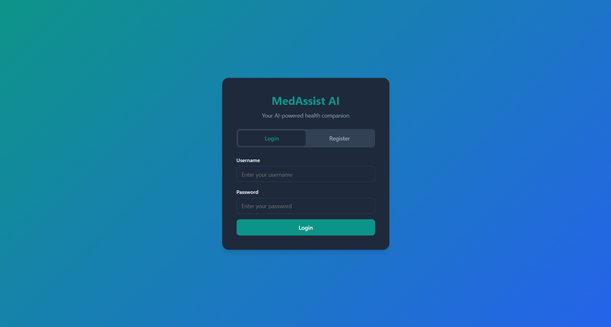
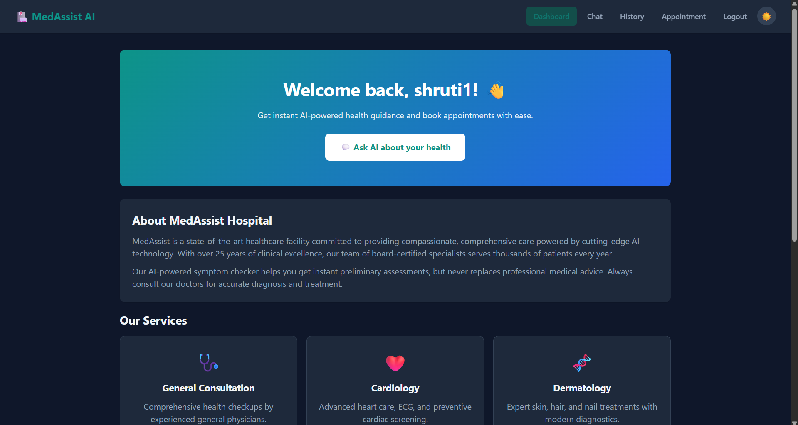
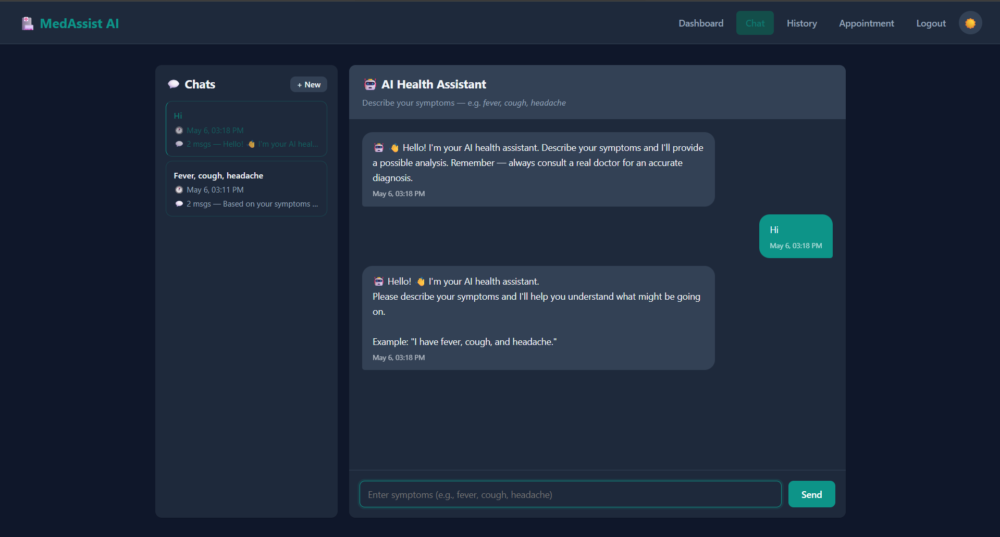
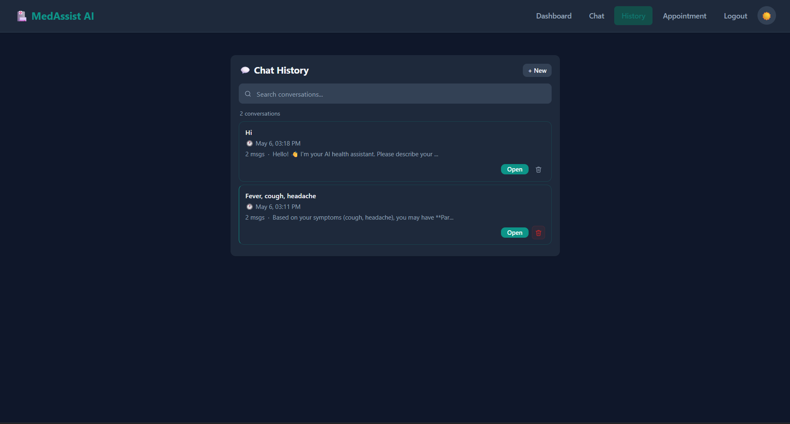
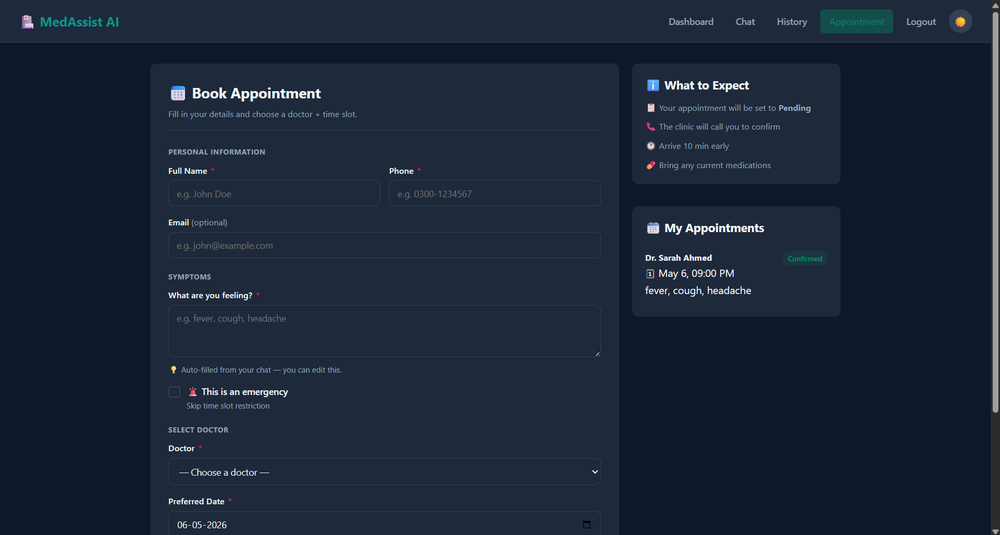
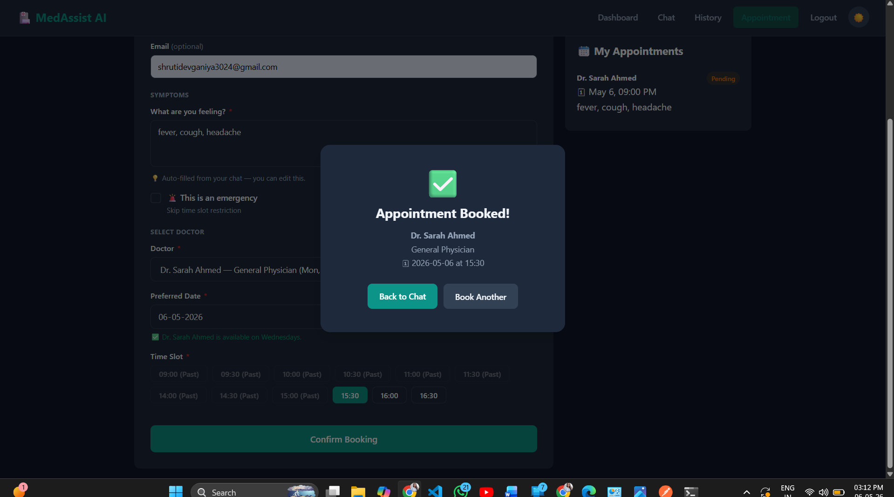
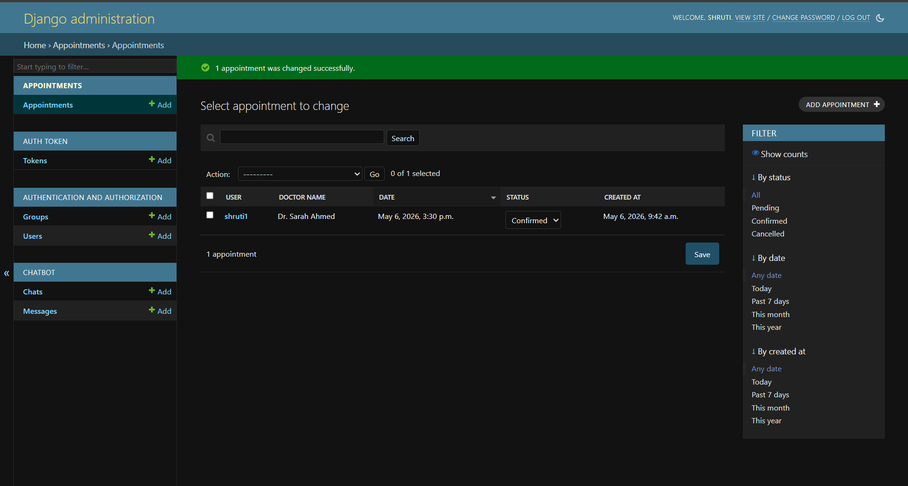
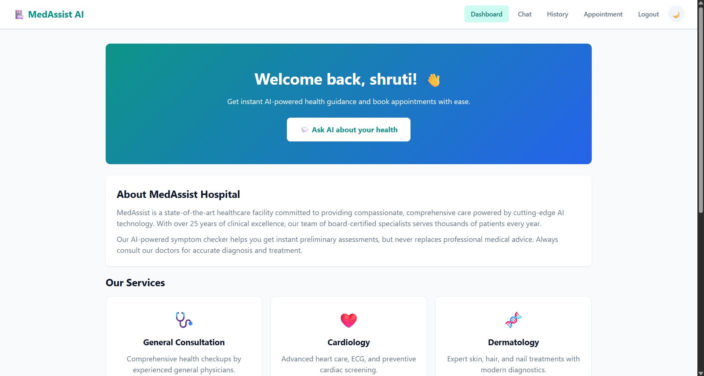
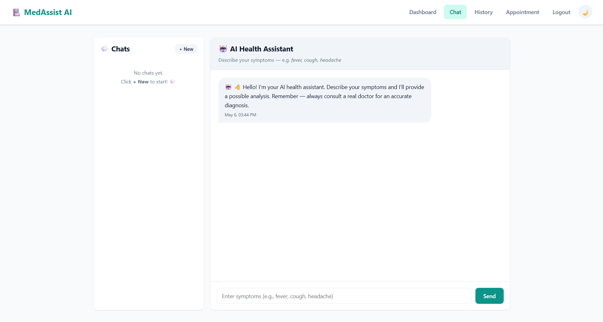
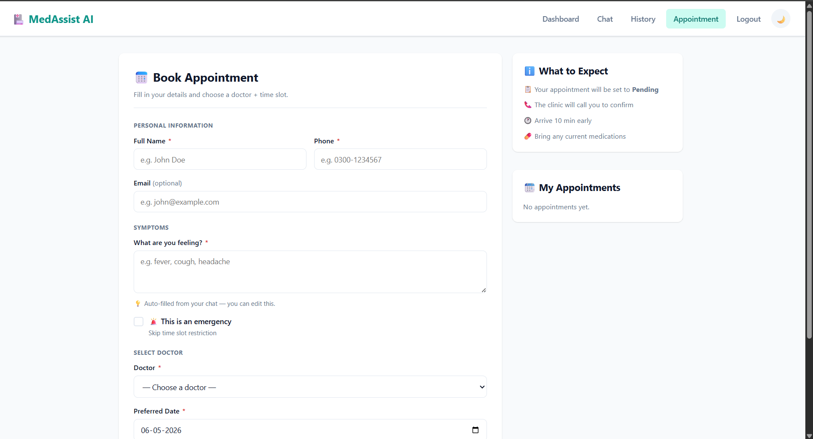

<div align="center">

# 🏥 AI Medical Assistant

### An intelligent, AI-powered medical assistant built with Django

### Featuring symptom analysis, appointment booking, and an admin panel


</div>

---

## 📖 Description

**AI Medical Assistant** is a full-stack web application built with **Django** and powered by **OpenAI's GPT API**. It allows patients to describe their symptoms, receive AI-driven preliminary health analysis, and book appointments with doctors — all through a clean, modern, dual-theme interface.

> ⚠️ **Disclaimer:** This application provides preliminary AI analysis only. It does **not** replace professional medical advice. Always consult a licensed doctor for accurate diagnosis and treatment.

---

## ✨ Features

| Feature                    | Description                                                      |
| -------------------------- | ---------------------------------------------------------------- |
| 🤖 **AI Symptom Analysis** | Describe symptoms and receive instant AI-powered health insights |
| 💬 **Chat System**         | Real-time chat interface with the AI health assistant            |
| 📜 **Chat History**        | Browse and revisit all previous symptom conversations            |
| 📅 **Appointment Booking** | Book appointments with available doctors by date and time slot   |
| 🔔 **Appointment Status**  | Track appointment status: Pending → Confirmed → Cancelled        |
| 🛡️ **Admin Panel**        | Django admin panel for managing users, appointments, and chats   |
| 🌙☀️ **Dark & Light Mode** | Beautiful UI with toggleable dark and light themes               |
| 🔐 **User Authentication** | Secure login, registration, and token-based authentication       |
| 📱 **Responsive Design**   | Works seamlessly across all screen sizes                         |

---

## 🛠️ Tech Stack

### Backend

* **Python 3.10+**
* **Django 4.2** — Web framework
* **Django REST Framework** — API layer
* **Simple JWT** — Token-based authentication
* **OpenAI API** — GPT-powered symptom analysis
* **SQLite** — Development database

### Frontend

* **HTML5 / CSS3 / JavaScript**
* **Custom dark/light theme system**
* **Responsive UI**

### Tools & Libraries

* `python-decouple` — Environment variable management
* `djangorestframework-simplejwt` — JWT auth tokens
* `whitenoise` — Static file serving
* `gunicorn` — Production WSGI server

---

## 📸 Screenshots

### 🌙 Dark Mode UI

| Screen               | Preview                                          |
| -------------------- | ------------------------------------------------ |
| **Login**            |              |
| **Dashboard**        |      |
| **Chat**             |                |
| **History**          |          |
| **Appointment**      |  |
| **Book Appointment** |                |
| **Admin Panel**      |              |

---

### ☀️ Light Mode UI

| Screen           | Preview                                             |
| ---------------- | --------------------------------------------------- |
| **Dashboard**    |        |
| **Chat**         |                  |
| **Appointment**  |    |

---

## ⚙️ Installation

### Prerequisites

* Python 3.10 or higher
* pip
* Git
* OpenAI API Key

---

### Step 1 — Clone the Repository

```bash
git clone https://github.com/YOUR_USERNAME/AI-Medical-Assistant.git
cd AI-Medical-Assistant
```

---

### Step 2 — Create Virtual Environment

```bash
python -m venv venv

# Activate on Windows
venv\Scripts\activate

# Activate on Mac/Linux
source venv/bin/activate
```

---

### Step 3 — Install Dependencies

```bash
pip install -r requirements.txt
```

---

### Step 4 — Configure Environment Variables

Create a `.env` file in the project root:

```bash
cp .env.example .env
```

Edit `.env` and fill in your values:

```env
SECRET_KEY=your-django-secret-key-here
DEBUG=True
OPENAI_API_KEY=your-openai-api-key-here
ALLOWED_HOSTS=localhost,127.0.0.1
```

---

### Step 5 — Run Migrations

```bash
python manage.py makemigrations
python manage.py migrate
```

---

### Step 6 — Create Admin User

```bash
python manage.py createsuperuser
```

---

### Step 7 — (Optional) Load Static Files

```bash
python manage.py collectstatic
```

---

## ▶️ How to Run

```bash
python manage.py runserver
```

Then open your browser and visit:

| Page                | URL                                |
| ------------------- | ---------------------------------- |
| 🏠 Home / Dashboard | http://127.0.0.1:8000/             |
| 💬 Chat             | http://127.0.0.1:8000/chat/        |
| 📅 Appointment      | http://127.0.0.1:8000/appointment/ |
| 🛡️ Admin Panel     | http://127.0.0.1:8000/admin/       |

---

## 🔌 API Endpoints

### 🔐 Authentication

| Method | Endpoint                 | Description             |
| ------ | ------------------------ | ----------------------- |
| POST   | /api/auth/register/      | Register a new user     |
| POST   | /api/auth/login/         | Login and get JWT token |
| POST   | /api/auth/token/refresh/ | Refresh JWT token       |

---

### 💬 Chat

| Method | Endpoint                  | Description                           |
| ------ | ------------------------- | ------------------------------------- |
| GET    | /api/chats/               | Get all chats for logged-in user      |
| POST   | /api/chats/               | Create a new chat session             |
| GET    | /api/chats/<id>/messages/ | Get messages for a chat               |
| POST   | /api/chats/<id>/messages/ | Send a message (triggers AI response) |

---

### 📅 Appointments

| Method | Endpoint                | Description                   |
| ------ | ----------------------- | ----------------------------- |
| GET    | /api/appointments/      | Get all appointments for user |
| POST   | /api/appointments/      | Book a new appointment        |
| PATCH  | /api/appointments/<id>/ | Update appointment status     |
| DELETE | /api/appointments/<id>/ | Cancel appointment            |

---

## 🗂️ Project Structure

```text
AI-Medical-Assistant/
│
├── medassist/              
│   ├── settings.py
│   ├── urls.py
│   └── wsgi.py
│
├── appointments/           
│   ├── models.py
│   ├── views.py
│   ├── serializers.py
│   └── urls.py
│
├── chatbot/                
│   ├── models.py
│   ├── views.py
│   └── urls.py
│
├── templates/              
├── static/                 
├── screenshots/            
│
├── .env.example            
├── .gitignore
├── manage.py
├── requirements.txt
└── README.md
```

---

## 🔮 Future Improvements

* 🔔 Email/SMS appointment confirmation notifications
* 📊 Patient health history dashboard with charts
* 🌍 Multi-language support (Urdu, Hindi, etc.)
* 📱 Mobile app version (React Native / Flutter)
* 🏥 Multiple hospital/clinic support
* 🤝 Video consultation integration
* 🧬 Integration with lab test results
* 💊 Prescription management system
* 📈 Admin analytics dashboard

---

## 👩‍💻 Author

**Shruti Devganiya**

GitHub

---

## 📄 License

This project is licensed under the MIT License see the LICENSE file for details.

---


<div align="center">

  <strong>Made with ❤️ and ☕ by Shruti Devganiya</strong>

  <p>⭐ Star this repo if you found it useful!</p>

  
</div>
